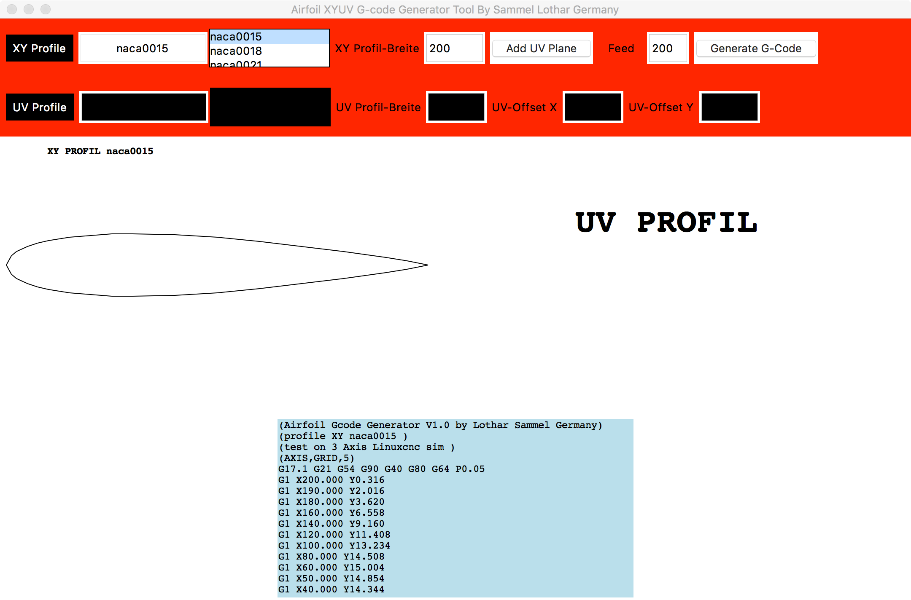

Airfoil G-code Generator
========================

**Author:** Sammel Lothar

This is a 3-4 Axis XY-XYUV Foam EDM Style airfoil generator.
It uses Airfoil Wing Profile data from the [UIUC Airfoil Data Site].

The Generator requires either [Python Imaging Library] (PIL) or [Pillow].

Installation on Debian:

    sudo apt-get install python-pillow

Installation on Mac:

    xcode-select --install
    sudo -H pip install pillow

To download the latest version of the airfoil data, use the script:

    python picimport_airfoil.py

To run the airfoil generator:

    python airfoil-generator.py

Screenshots
-----------

[Python Imaging Library]:   http://www.pythonware.com/products/pil/
[Pillow]:                   https://python-pillow.org/
[UIUC Airfoil Data Site]:   http://m-selig.ae.illinois.edu/ads.html
