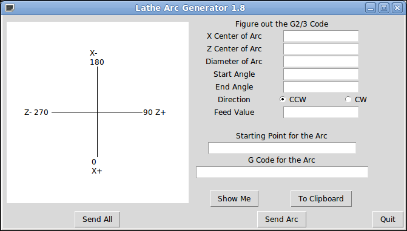

Arc Generator
=============

**Author:** John Thornton

**Downloads:**
* [arcgen-mill.py](https://github.com/linuxcnc/simple-gcode-generators/raw/master/arcgen/arcgen-mill.py)
* [arcgen-lathe.py](https://github.com/linuxcnc/simple-gcode-generators/raw/master/arcgen/arcgen-lathe.py)

This tool takes the center of an arc, the diameter, the start and end angle and spits out the G-Code.
The start point for the arc and the G2/3 code for the arc are generated.

Screenshots
-----------

