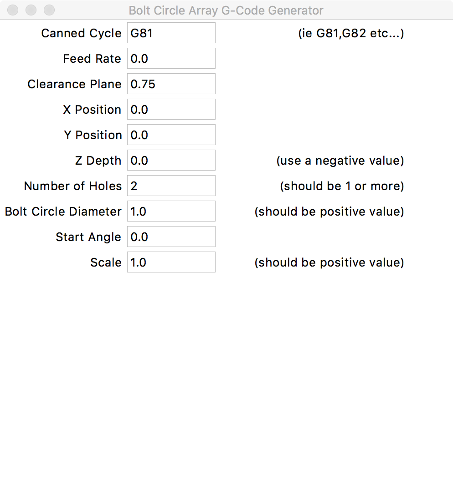

Bolt Circle Array
=================

**Author:** Dan Falck

**Download:** [boltcircle.py](https://github.com/linuxcnc/simple-gcode-generators/raw/master/boltcircle/boltcircle.py)

This program generates a circular array for canned drill cycles in a mill (ie 'bolt circle'). This program used face.py as a template, so it looks very similar. Some of the entry widgets have predefined values in them. Look carefully at these before pressing the 'Generate G-code' button. Note this generates a snippet of G code intended to be inserted into your G-code.

Screenshot
-----------

