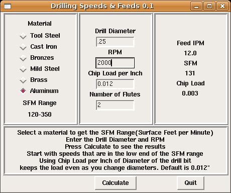

Drill Speed and Feed Tool
=========================

**Author:** John Thornton

**Download:** [drill-speed.py](https://github.com/linuxcnc/simple-gcode-generators/raw/master/drill-speed/drill-speed.py)

This tool helps you to calculate the speeds and feeds for drilling.

Instructions
------------

* Select a material to get the SFM Range (Surface Feet per Minute)
* Enter the Drill Diameter and RPM
* Press Calculate to see the results
* Start with speeds that are in the low end of the SFM range
* Using Chip Load per Inch of Diameter of the drill bit keeps the load even as you change diameters. Default is 0.012.

Screenshot
-----------

