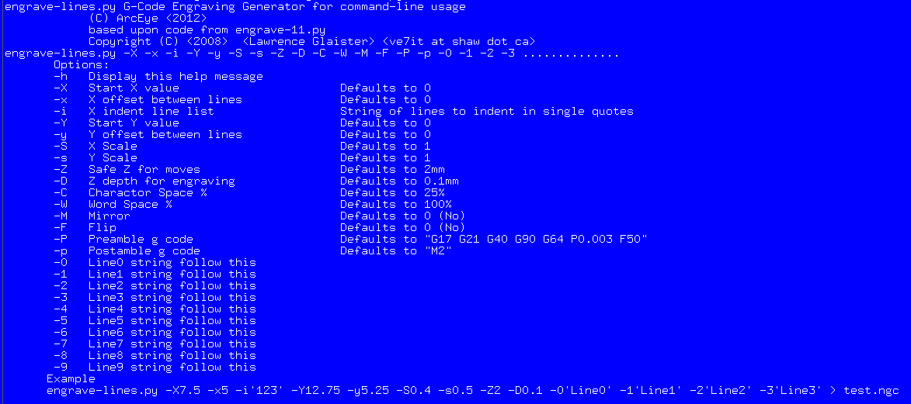

Multi-line Text Engraving Software
==================================

**Author:** ArcEye

**Download:** [engrave-lines.py](https://github.com/linuxcnc/simple-gcode-generators/raw/master/engrave-lines/engrave-lines.py)

Command line tool to generate G-Code to engrave multiple lines of text with optional indents to STDOUT.

Allows the generation of multiple lines of engraved text in one go.
Will take each string arguement, apply X and Y offset generating code until last line done.

Based upon code from [engrave.py](/engrave/).


Usage
-----

Ensure the engrave-lines file is executable (zipping sometimes removes attributes)

    chmod 755 engrave-lines.py

For a list of options just use -h:
    
    ./engrave-lines.py -h

or read the included [man page](engrave-lines.3).


Options
-------

    engrave-lines.py [-X -x -i -Y -y -S -s -Z -D -C -W -M -F -P -p] -0 -1 -2 -3 ....

```
-h   Display this help message
-X   Start X value                       Defaults to 0
-x   X offset between lines              Defaults to 0
-i   X indent line list                  String of lines to indent in single quotes
-Y   Start Y value                       Defaults to 0
-y   Y offset between lines              Defaults to 0
-S   X Scale                             Defaults to 1
-s   Y Scale                             Defaults to 1       
-Z   Safe Z for moves                    Defaults to 2mm
-D   Z depth for engraving               Defaults to 0.1mm
-C   Charactor Space %                   Defaults to 25%
-W   Word Space %                        Defaults to 100%
-M   Mirror                              Defaults to 0 (No)
-F   Flip                                Defaults to 0 (No)
-P   Preamble g code                     Defaults to "G17 G21 G40 G90 G64 P0.003 F50"
-p   Postamble g code                    Defaults to "M2"
-0   Line0 string follow this            String in single quotes
-1   Line1 string follow this            String in single quotes
-2   Line2 string follow this            String in single quotes
-3   Line3 string follow this            String in single quotes
-4   Line4 string follow this            String in single quotes
-5   Line5 string follow this            String in single quotes
-6   Line6 string follow this            String in single quotes
-7   Line7 string follow this            String in single quotes
-8   Line8 string follow this            String in single quotes
-9   Line9 string follow this            String in single quotes
```

Formatting
----------

All strings must be enclosed in single quotes for switches ```-i -P -p -0 -1-2 -3 -4 -5 -6 -7 -8 -9```
No spaces between switch and argument.


Example
-------

    engrave-lines.py -X7.5 -x5 -i'13' -Y12.75 -y5.25 -S0.4 -s0.5 -Z2 -D0.1 -0'Line0' -1'Line1' -2'Line2' -3'Line3' > test.ngc

Will engrave the 4 lines of text with a Y offset of 12.75 between lines and lines 1 and 3 indented to 12.5 ( -X + -x)


Screenshot
-----------


