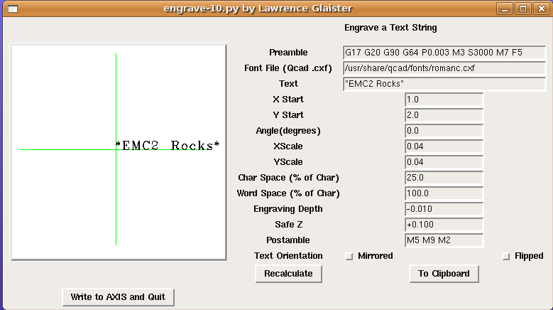

Text Engraving Software
=======================

**Author:** Lawrence Glaister

**Downloads:**
* [engrave.py](https://github.com/linuxcnc/simple-gcode-generators/raw/master/engrave/engrave.py)
* [CXF fonts](cxf-fonts)

This software engraves a text string.

Features
--------

* Uses CXF format font files (nice stroked font definitions)
* You will need the .cxf font files from the link above (or use the ones from the QCAD v2 package)
* Supports flipped (about X axis) or mirrored (about Y axis) text
* Mirrored text is useful for back cutting on Plexiglas panels
* Usable as an axis filter program
* Independent X and Y scaling so the look of a font can be modified
* Adjustable character and word spacing
* String can be plotted at any arbitrary angle
* G-code can be copied to the clipboard for easy insertion into other gcode programs
* Use of gcode variables for start point, scaling, rotation and Z values for easy code block reuse or tweaking

Screenshot
-----------

