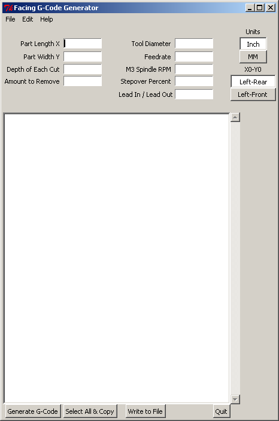

Facing Software
===============

**Author:** John Thornton

**Download:** [face.py](https://github.com/linuxcnc/simple-gcode-generators/raw/master/face/face.py)

The facing software is super simple. You input a few things and press a button and your code is saved to your NC directory ready to open in LinuxCNC!

Assumes that the top of the material is Z0 and nothing is above Z0.

Features
--------

* Lead-in, lead-out value can now be changed
* Now has a radio button to set the X0-Y0 (Home) position: Left-Rear or Left-Front
** To change the default, see the comments in the file
* Has a radio button for Inch/MM Version
* Accepts fractions in any field where this is appropriate
* One step file save after setting the NC File Directory Option.
* Vertical Scroll Bar added to text box.
* Added Spindle Speed setting that automaticly adds M2 and M5 if you specify a value
* Can leave Depth of Cut, Spindle Speed and Stepover blank.
* NC File Directory is saved to an .ini file!
* If you open in Axis you can directly save the G-Code to Axis

Screenshot
-----------

