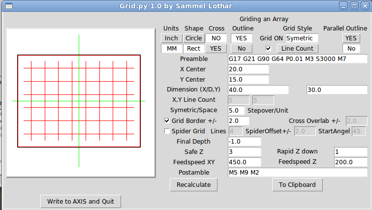
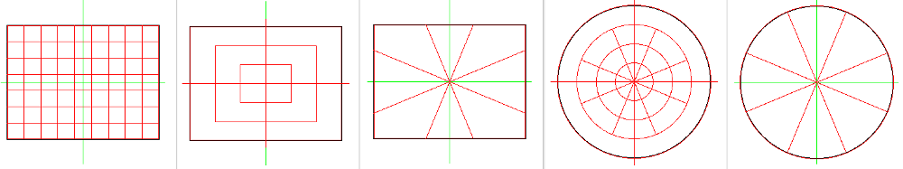

Grid Generation Software
========================

**Author:** Sammel Lothar

**Download:** [grid.py](https://github.com/linuxcnc/simple-gcode-generators/raw/master/grid/grid.py)

This was written to test the speed and the accuracy of a milling mashine, 
with the grid alot of moves are taken and you can see the accurate by,
checking Zero Border on the grid if it not harming the outside Shape!

Screenshots
-----------

