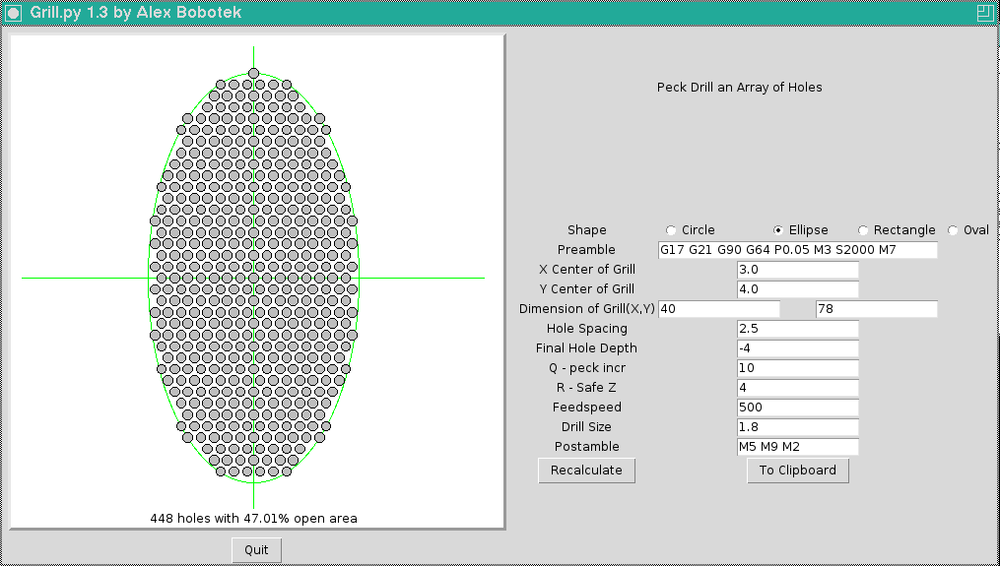

Grill Drilling Software
=======================

**Download**: [grill.py](https://github.com/njh/simple-gcode-generators/raw/master/grill/grill.py)

This software peck drills a circular array of holes typically used as a speaker grill or as ventilation holes in a chassis panel.

Features
--------

* Can drill circular, elliptical, rectangular or oval rectangular shaped array of holes
* Usable as an axis filter program
* G-Code can be copied to the clipboard for easy insertion into other gcode programs

Screenshot
-----------

