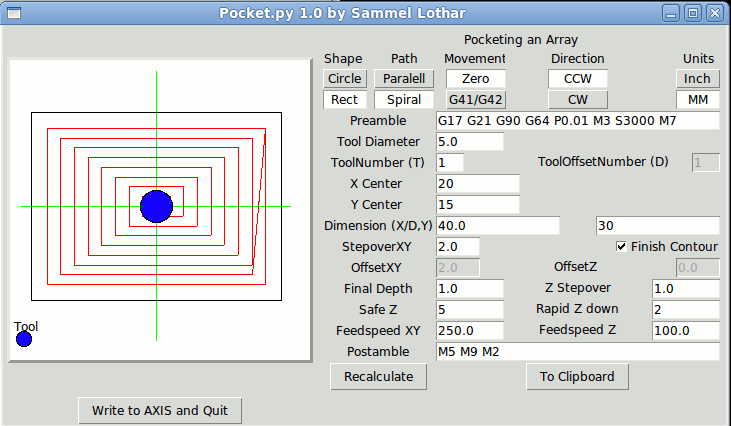

Pocketing Generator Software
============================

**Author:** Alex Bobotek

**Download:** [pocket.py](https://github.com/linuxcnc/simple-gcode-generators/raw/master/pocket/pocket.py)

This is for Generating simple Pocket Style Toolpaths with Different depth/stepover.
Version 1 does only support Zero Path but you can simply edit the final path to G41 new spiral depth mode.

Screenshots
-----------

