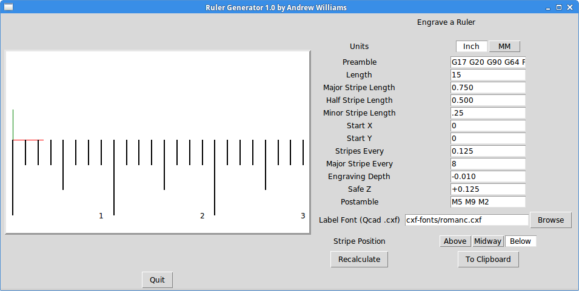

Ruler Engraving Software
========================

**Author:** Andrew Williams

**Download:** 
* [ruler.py](https://github.com/linuxcnc/simple-gcode-generators/raw/master/ruler/ruler.py)
* [CXF fonts](cxf-fonts)

This software engraves a ruler of any length in metric or standard.

Features
--------

* Uses CXF format font files (nice stroked font definitions) for adding numbers to ruler
* You will need the .cxf font files from the link above (or use the ones from the QCAD v2 package)
* Adjustable number of minor and major ticks
* Adjustable start and stop positions
* Usable as an axis filter program (see below)
* G-Code can be copied to the clipboard for easy insertion into other gcode programs
* Use of variables for start point and Z values for easy code block reuse

Screenshot
-----------

